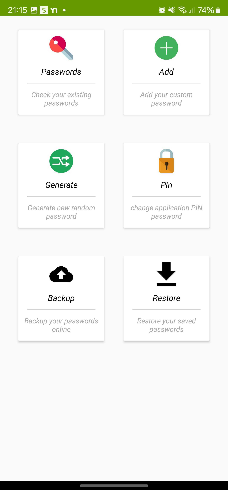
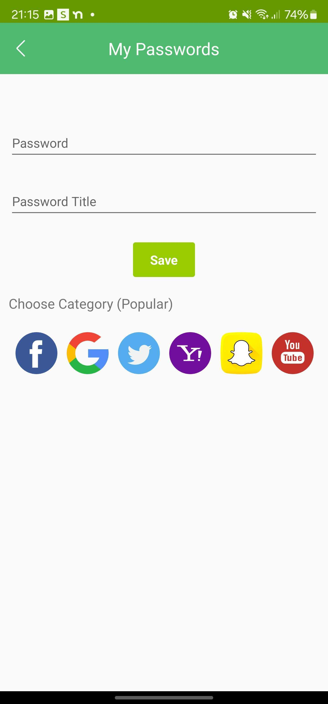
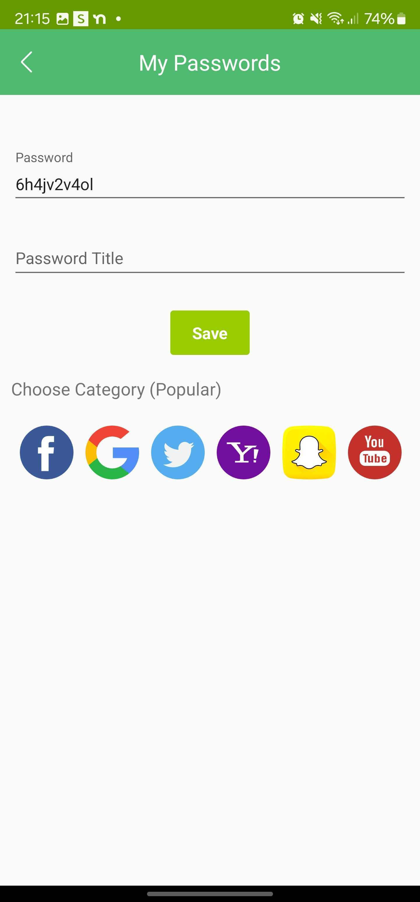
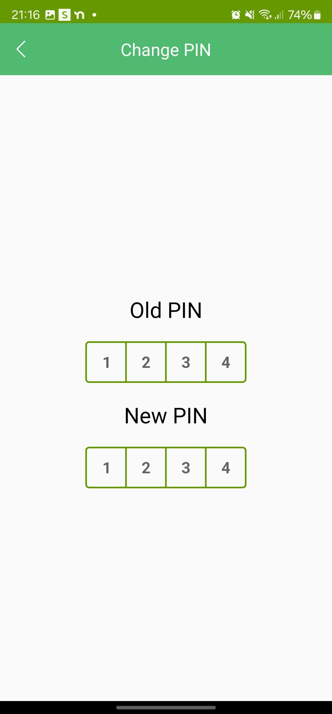

# Ezy Password Manager Android App

> Simple Password manager app you can use to save your passwords and keep backup in firebase database

Star this project to get future updates

Fork this project

change package name

integrate your google-services.json in app folder

Enable firebase database for this app

Follow the guide in this link to integrate Firebase database in app https://www.vogella.com/tutorials/Firebase/article.html

Add the debug SHA in firebase or create release apk and add release SHA in firebase to allow app to access your database

## Current Features

- Add and remove passwords
- Backup and restore passwords from firebase database
- Generate Random Password
- Set and Change Pin

## Screenshots

